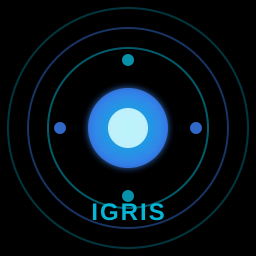

# IGRIS — Cross-Platform Device Ecosystem

IGRIS is a cross-platform desktop ecosystem app written in **Rust**. It turns your PCs, laptops, and devices on the same LAN into a connected mesh: sync your clipboard, mirror and reply to notifications across devices, and transfer files of any size with TLS encryption — all without a cloud server, an account, or an internet connection.

Everything runs locally on your network as a single native binary for **Windows, macOS, and Linux**.



---

## Features

### Device Mesh
- **LAN Device Discovery** — Automatically finds every IGRIS instance on the local subnet:
  - Multi-interface /24 scan (IPs 1–254, up to 50 concurrent probes) against the HTTP and TLS ports — every usable local IPv4 interface's subnet is scanned (private ranges first), so multi-homed hosts (VPN, vEthernet, second NICs) never go blind; the probe host's own addresses on all interfaces are skipped to prevent self-discovery
  - 30-second heartbeat refresh; untrusted devices age out after 120 seconds; trusted devices persist as offline
- **Link & Trust** — Pair devices with a one-click link handshake over HTTPS; trusted (linked) devices are the only ones that receive clipboard and notification data
- **Stable Identity** — The device UUID is persisted (`pkg/device_id`) so links survive restarts; a fresh random ID per launch used to silently break every existing link until a manual re-pair
- **Encrypted Transport** — All peer traffic travels over TLS 1.3 (self-signed certs via `rcgen` + `rustls`), with a transparent TLS proxy terminating at each device's local HTTP service
- **Event-Driven Architecture** — A pub/sub event bus (`DeviceDiscovered`, `ClipboardChanged`, `NotificationReceived`, `DeviceTrusted`, …) lets future features subscribe without touching the core
- **Persistent State** — Devices, trust lists, clipboard history (50 entries), and notification history (100 entries) stored as JSON under `pkg/ecosystem/`

### Universal Clipboard Sync
- **Automatic** — Clipboard text syncs across all linked devices in real time (1-second polling)
- **Loop-Proof** — SHA-256 content hashing plus a two-marker diff (`last_content_hash` / `last_applied_hash`) prevents echo broadcasts and feedback loops
- **Trust-Gated** — Only devices you've linked receive your clipboard
- **Platform-Native** — Win32 clipboard FFI on Windows, `pbpaste`/`pbcopy` on macOS, `xclip` on Linux

### Notification Sync
- **Mirror** — Notifications from any linked device appear in your notification center with device attribution
- **Reply from Anywhere** — Reply to notifications on remote devices (paste-back integration per platform)
- **History** — Last 100 notifications persisted, with read/unread state

### FastSwap File Transfer
- **LocalSend v2.0 Protocol** — Interoperable with other LocalSend-compatible apps on your network
- **TLS Encrypted** — Self-signed TLS termination on a dedicated proxy port
- **Approval Flow** — Incoming transfers show a full-screen accept/deny popup with a 60-second approval window
- **Live Progress** — Per-file progress, transfer speed, and ETA for both sender and receiver
- **Folders Preserved** — Send whole directories; relative folder structure is recreated on the receiving side
- **Smart File Handling** — Path-traversal sanitization, conflict renaming (`name (1).ext`), MIME detection, and chunked streaming (64 KB chunks) with cooperative cancellation
- **10 GiB Body Limit** — Large transfers supported

### Cross-Platform Abstraction Layer
- **PlatformClipboard** — Win32 FFI / `pbpaste` / `xclip`
- **PlatformNotification** — NotificationCenter scraping (macOS), WinRT toast queries (Windows), D-Bus probe (Linux)
- **System Control** — Volume, brightness, power, WiFi, Bluetooth per OS
- **App Launcher** — Fuzzy-matched app registry with 50+ aliases per platform

### Desktop Companion UI
A Dioxus 0.7 desktop shell with panels for:
- **Devices** — scan, link, unlink, and monitor your device mesh
- **Notifications** — center with cross-device replies
- **FastSwap** — transfer panel with device grid and live progress
- **Alarms & Reminders**, **Camera** (FFmpeg), **File Search**, and **System Info** utilities

### Optional: Voice Interface
The binary also ships a voice module (wake word, offline STT/TTS, plugin-driven commands). It is a companion surface for the ecosystem — all ecosystem features are reachable from the UI without it.

---

## Architecture

```
src/
├── eco/                         # Active device-mesh runtime
│   ├── manager.rs               #   EcoManager lifecycle (init → start → shutdown)
│   ├── discovery.rs             #   Axum HTTP server (53327) + multi-interface subnet scan
│   ├── clipboard.rs             #   ClipboardManager — 1s poll + hash diff
│   ├── notification.rs          #   NotificationManager — 2s poll, reply, history
│   ├── sync.rs                  #   SyncManager — fan-out to linked peers
│   ├── transport.rs             #   HTTPS client for peer push
│   ├── protocol.rs              #   EcoMessage envelope + payload types
│   ├── pairing.rs               #   Pairing/trust + OTP machinery
│   ├── storage.rs               #   JSON persistence (trust, clipboard, notifications)
│   ├── events.rs                #   EventBus pub/sub
│   ├── crypto.rs                #   Self-signed certs (rcgen), TLS integration
│   └── …
├── fastswap/                    # LocalSend v2.0-compatible file transfer
│   ├── network/
│   │   ├── server.rs            #   Axum receiver (info/register/prepare/confirm/upload)
│   │   ├── client.rs            #   Sender (prepare → confirm → chunked upload)
│   │   └── discovery.rs         #   HTTPS subnet scan for LocalSend peers
│   ├── tls.rs                   #   Self-signed cert generation (rcgen + ring)
│   └── models/                  #   Device, FileInfo, TransferProgress (speed/ETA)
├── platform/                    # OS abstractions (Windows/macOS/Linux)
├── ui/                          # Dioxus panels (devices, notifications, FastSwap, …)
├── commands/                    # Utility command handlers (files, system, web, …)
├── plugins/                     # Built-in plugin registry (12 builtins)
├── core/ nlu/ online/           # Optional voice stack (STT/VAD/TTS/NLU + online NIM chat)
└── setup_manager/               # First-run install: models, FFmpeg, Piper, LLVM
```

### Networking Map

| Port  | Scheme | Service |
|-------|--------|---------|
| 53317 | HTTP   | FastSwap LocalSend v2 server |
| 53318 | TLS    | FastSwap TLS proxy (peer uploads) |
| 53327 | HTTP   | Ecosystem REST API (`/api/ecosystem/v1/*`) |
| 53328 | TLS    | Ecosystem TLS proxy (peer sync) |

### Ecosystem REST API

All routes are plain HTTP on the local listener (outbound peer calls use the TLS proxy):

| Endpoint | Purpose |
|----------|---------|
| `GET  /api/ecosystem/v1/info` | Discovery probe — device identity + capabilities |
| `POST /api/ecosystem/v1/clipboard/sync` | Receive clipboard payload from a peer |
| `POST /api/ecosystem/v1/notification/sync` | Receive notification payload from a peer |
| `POST /api/ecosystem/v1/notification/reply` | Forward a reply to the source device |
| `POST /api/ecosystem/v1/pair/request` | Link handshake (trusts the requesting device) |
| `POST /api/ecosystem/v1/pair/untrust` | Unlink a device |

FastSwap additionally exposes `GET /api/localsend/v2/info`, `POST /api/localsend/v2/prepare-upload`, `POST /api/localsend/v2/confirm-upload`, and `POST /api/localsend/v2/upload` (LocalSend v2 wire protocol).

### Data Flow

```
Device A                                    Device B
┌───────────────────────┐                   ┌───────────────────────┐
│ ClipboardManager      │                   │                       │
│  (1s poll, hash diff) │                   │   ClipboardManager    │
│        │              │                   │   (1s poll, apply)    │
│        ▼              │                   │        ▲              │
│ SyncManager ──HTTPS───┼──── TLS 53328 ────┼──► HTTP 53327         │
│ (trusted peers only)  │                   │   (emit+apply)        │
│                       │                   │                       │
│ DiscoveryService      │◄══ subnet scan (HTTP 53327/TLS 53328) ══│ DiscoveryService      │
└───────────────────────┘                   └───────────────────────┘

Sender (FastSwap)                          Receiver (FastSwap)
  prepare-upload ──► session + file tokens ──► approval popup (60s)
  confirm-upload ◄──── approved ──────────────┘
  upload (64KB chunks) ──────────────────────► Downloads/ (sanitized,
                                               conflict-renamed, folders kept)
```

---

## Quick Start

### Prerequisites
- Rust 1.75+
- Windows 10+, macOS 10.13+, or Linux (x86_64)
- 4 GB RAM (8 GB recommended)
- Devices must be on the same LAN/subnet

### Build & Run

```bash
git clone <repo-url> && cd igris-ecosystem
cargo run --release
```

First launch runs the setup manager, which installs the runtime packages (models, FFmpeg, Piper, LLVM) into `pkg/`.

### Link Two Devices
1. Launch IGRIS on both devices (same network)
2. Open the **Devices** tab — each machine appears within one scan cycle (~30 s)
3. Click **LINK** on the peer — the handshake completes over HTTPS; both sides mark each other as trusted
4. Copy text on either device — it appears on the linked device's clipboard instantly

### Mobile Companions
Android phones join the same mesh through the native companion app
([`igris-android`](../igris-android)), which drives the shared protocol crate
([`igris-protocol`](../igris-protocol)) — identical wire protocol, so the
desktop discovers and links phones exactly like any other peer. Clipboard
from an Android background requires the app's gesture-detection machinery
(see its README); phone pushes arrive like any other peer's.

Field-verified mesh: **Windows desktop + POCO F6 (HyperOS) + iQOO I2501
(Funtouch OS)** — clipboard, discovery, and pairing across all three.

### Send Files
1. Open the **FastSwap** panel
2. **Scan Network** to find peers
3. **Select Files** or **Select Folder**
4. Click **Send** on the target device — the receiver gets a full-screen approval popup
5. Files land in the receiver's `Downloads` folder

---

## Configuration

### Ecosystem config — `pkg/ecosystem/ecosystem_config.json`

```json
{
  "enabled": true,
  "port": 53327,
  "auto_discovery": true,
  "clipboard_sync": true,
  "notification_sync": true,
  "device_name": "MyPC",
  "storage_dir": "pkg\\ecosystem"
}
```

### Data & state — `pkg/`
| File | Contents |
|------|----------|
| `device_id` | This device's persistent UUID (stable across restarts — peers key their trust store by it) |
| `ecosystem/ecosystem_config.json` | Sync toggles, device name, port |
| `ecosystem/trusted_devices.json` | Persistent linked-device IDs |
| `ecosystem/clipboard_history.json` | Last 50 clipboard entries (hash, content, source, timestamp) |
| `ecosystem/notification_history.json` | Last 100 notifications with read/replied state |
| `ecosystem/ecosystem_key.pem` / `.pub` | rcgen key pair + self-signed cert (device identity) |

### TLS certificates — `pkg/certs/`
Self-signed `fastswap_cert.der` / `fastswap_key.der` generated on first run (SAN `igris.local`).

---

## Environment Variables

| Variable | Default | Description |
|----------|---------|-------------|
| `IGRIS_ONLINE_MODE` | `false` | Enable the optional online voice stack on launch |
| `NVIDIA_API_KEY` | — | API key for the optional online voice stack |
| `NVIDIA_NIM_MODEL` | `meta/llama-3.1-8b-instruct` | Model for the optional online chat |

The ecosystem itself requires no keys, accounts, or internet.

---

## Development

```bash
cargo build            # debug
cargo build --release  # release
cargo test             # unit tests (VAD, NLU, plugins, transfers, sanitizers)
cargo run --release    # run
```

Notes:
- The ecosystem runs inside the main process — no separate daemon or service
- Discovery scans every usable IPv4 interface's /24 (private ranges first, max 4 subnets, self-addresses skipped); cross-subnet setups can use manual IPs
- Outbound peer traffic always uses the TLS proxy port; inbound arrives plaintext on the local listener
- Session state (transfers, devices, history) is in-memory except the JSON stores listed above

---

## Troubleshooting

| Issue | Solution |
|-------|----------|
| Devices not discovered | Same subnet required; allow ports 53317/53318/53327/53328 in the firewall; wait one 30 s scan cycle. Discovery now scans **all** local interfaces' /24s, so VPN/virtual adapters no longer blind it |
| One device sees the other but not vice versa | The blind side picked a wrong network interface before — fixed by multi-interface scanning; also check the port-fallback trap below |
| Desktop invisible after relaunch | A second running instance silently binds 53329+ (fallback range) and is invisible to scanners — kill duplicate `igrisecosystem` processes before relaunching |
| Clipboard not syncing | Both devices must be **LINKED** (trusted); sync is text-only; ensure `clipboard_sync: true`; links survive restarts via the persisted `pkg/device_id` |
| Transfer approval times out | The 60-second approval window expired — the sender sees a timeout |
| Files missing on receive | Check `~/Downloads`; conflict-renamed files get a `(1)` suffix |
| Notifications empty | Notification *reading* is platform-limited: macOS fully supported; Windows/Linux expose the API but system-level read-back may return nothing |
| Certificate errors | Self-signed certs are expected — the app accepts them by design on the LAN |
| Ports in use | Server and proxy retry across 10-port ranges and log the actual ports — but peers only scan the canonical ports, so a fallback instance is undiscoverable |

---

## Roadmap

- [x] LAN device discovery (multi-interface IPv4 subnet scan)
- [x] Link/trust handshake with persistent trust store
- [x] Persistent device identity (`pkg/device_id`) — links survive restarts
- [x] Universal clipboard sync (loop-proof, hash-diffed)
- [x] Cross-device notification mirror + reply
- [x] FastSwap file transfer (LocalSend v2.0, TLS, approval flow, folders)
- [x] Cross-platform abstraction layer (clipboard, notifications, system control)
- [x] Android companion on the shared protocol core ([`igris-android`](../igris-android) + [`igris-protocol`](../igris-protocol)); background clipboard verified on HyperOS and Funtouch OS
- [ ] Image/file clipboard sync
- [ ] Transfer history persistence
- [ ] Remote input and media control between devices
- [ ] Relay mode for non-LAN (cross-subnet / internet) peers
- [ ] Session handoff and shared AI memory between devices
- [ ] Converge desktop onto the shared `igris-protocol` crate (currently a fork; protocol logic is duplicated)

---

## License

MIT
